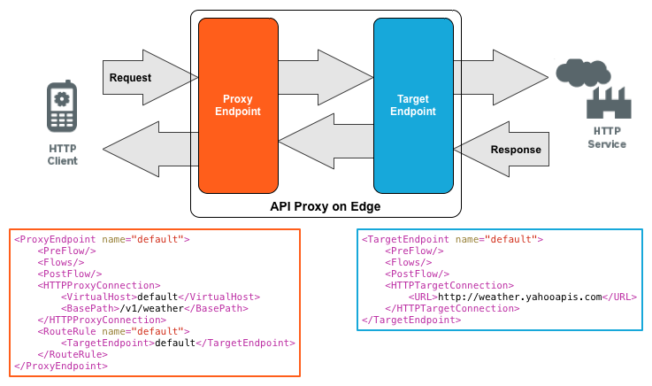

# Apigee
Apigee is a API Managment Platform to design, secure, analyze, and scale APIs anywhere with visibility and control.

## Apigee Proxy Model
* Apigee proxy edge stands is between the client and target endpoint
* It consists of ProxyEndpoint and TargetEndpoint
* Both endpoints are configured as preFlow - > conditionalFlow -> postFlow
* Request first passthough the proxy preFlow -> conditionalFlow -> postFlow then target preflow > conditionalFlow -> postFlow
* Response first passthough the target preFlow -> conditionalFlow -> postFlow then proxy preflow > conditionalFlow -> postFlow 

## Apigee Policy
- [Secure Policy](#secure-policy)
- [Rate Limit Policy](#rate-limit-policy)
- Caching and Persistence
- Transforming Messages

### Secure Policy
Spike Arrest

Quota Policy

Concurrent Rate Limit

### Rate Limit Policy